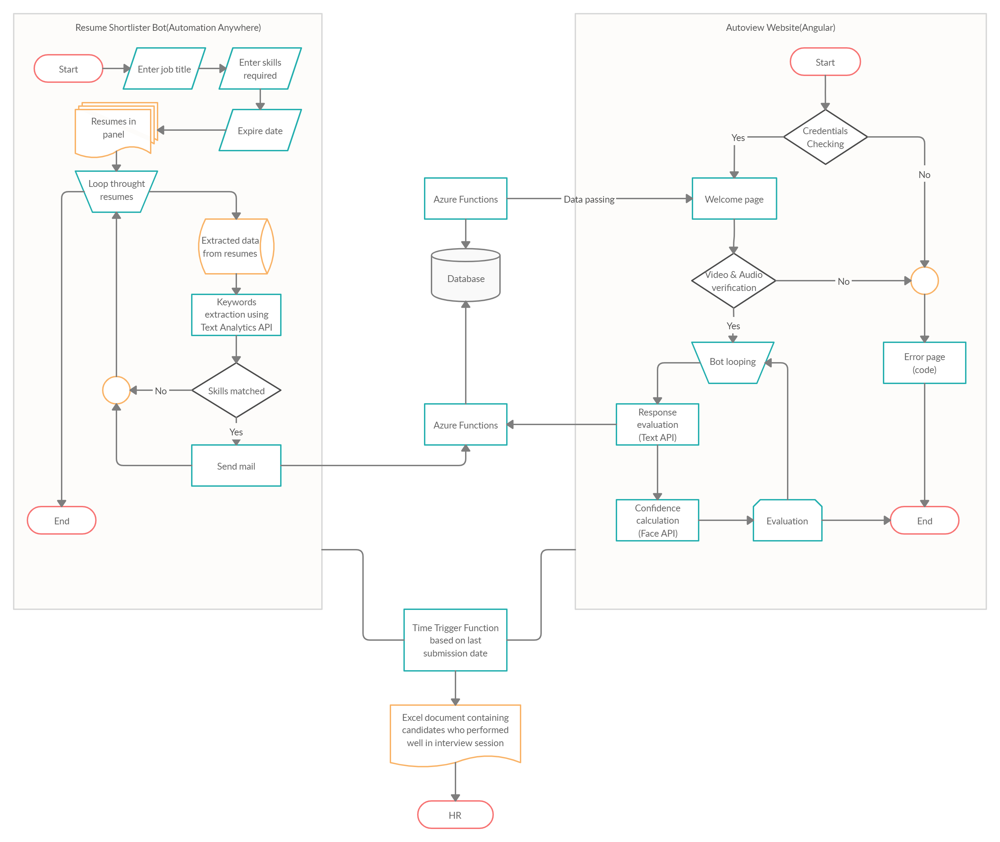

# Autoview
A automated interview bot made with Angular, Azure Cognitive Services & Automation Anywhere

## Table of Contents
* [General-info](#general-info)
* [Technologies](#technologies)
* [Flow-chart](#flow-chart)

## General info
In general scenario, a HR has to go through tons of resumes to find out eligible candidates for the interview, even now they have to interview hundreds of candidates face-to-face/virtually to select the right person. All of this is a time consuming process which often takes few days to weeks. Our project intention is to reduce this time from days to few hours. Autoview consists of two modules:

The first module has been developed using Automation Anywhere. HR just has to enter the job title, skills required and expire date; that's all, the bot handles the rest of the process. The bot loops throught all resumes in the panel and shortlists the resumes based on the required skills and relevant work experience. For this process, we have used Azure Text Analytics API to analyze relevant keywords in the resume. If a resume is shortlisted, a mail containing login credentials and the link to the website to mailed to the candidate.
  
Second module is completed developed using Angular and Azure functions as backend. Candidate has to login using the given credentials. One user can login only once and take the session. After successful login, user is now navigated to welcome page where the bot introduces itself and requests for webcam and microphone access. Once the access is given now the candidate is directly to interview page. Here the bot checks for user presences using video and audio means. After greeting the user, bot now starts asking questions randomly based on the required skills mentioned by HR. For every response, facial expressions and answer relevance is evaluated. User confidence level is accessed using Azure Face API. Every answer is evaluted using keywords matching to original answer. After asking n no.of questions, now the bot ends the session by thanking the user and submitiing his score.

Finally, a Time Trigger function is triggered on the date specified by the HR and a mail contains the list of selected candidates in excel is mailed to HR.

## Technologies
* Angular 8
* Azure Face API
* Azure Functions(Python)
* Azure Text Analytics API
* Automation Anywhere Community Edition
* ngx-webcam
* ngx-speech-recognition
* speak-tts

## Flow Chart

